# Skywalking

本项目使用Skywalking监控系统，用于监控SpringBoot项目以及后续用于毕设系统性能测试

### 1 下载安装

下载地址：

可以前往SkyWalking官网或者下面这个地址

[Apache Archive Distribution Directory](http://archive.apache.org/dist/skywalking/)

下载APM以及Java Agent，这两个的版本可以不一致，测试APM10.1，Agent9.4可以正常运行

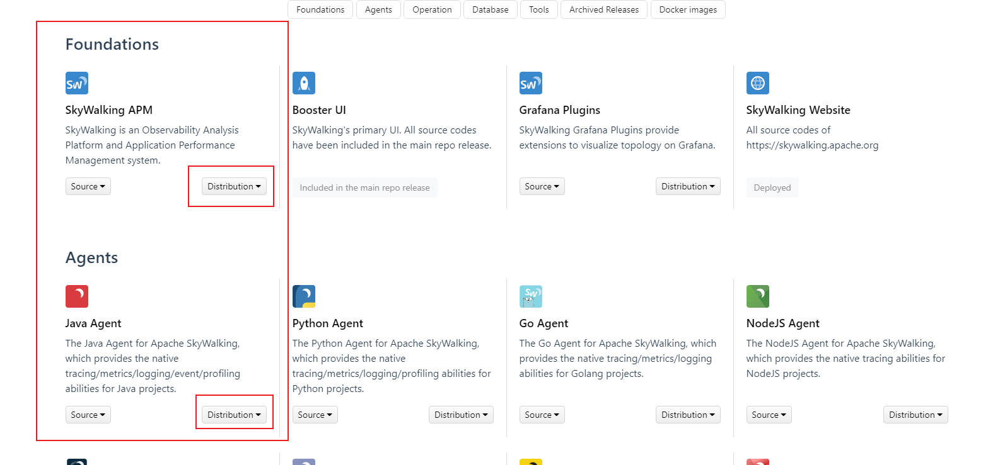


这里如果APM选用10.0+的版本 jdk就不支持1.8了  测试jdk17可以正常运行

### 2 相关配置

修改webapp中的yml中的端口，这是skywalking网页端

可以按照需求修改config/yml，这是skywalking的相关配置

启动oapService和webappService即可

oapService.bat

webappService.sh

这时候可以通过配置的webapp端口访问skywalking网页端


### 3 SpringBoot项目无侵入接入SkyWalking

之前写好的SpringBoot项目无需修改任何代码，只需要在启动配置中添加vm参数

```
-javaagent:D:\dev_soft\skywalking\skywalking9.4agent\skywalking-agent\skywalking-agent.jar
```

此时等待一会刷新数据后就可以看到接入的SpringBoot服务了

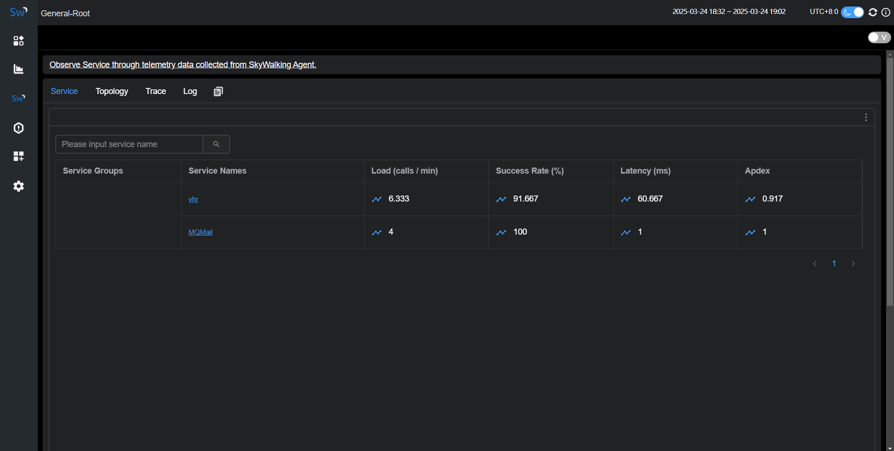


### 4 监控相关

#### 服务整体情况图

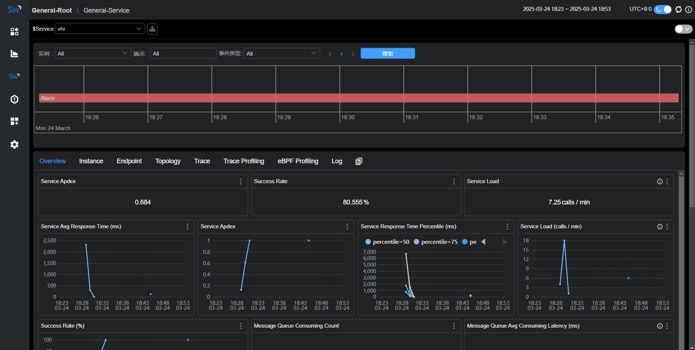

记录了请求耗时排行，可以清晰的看到哪些请求比较慢

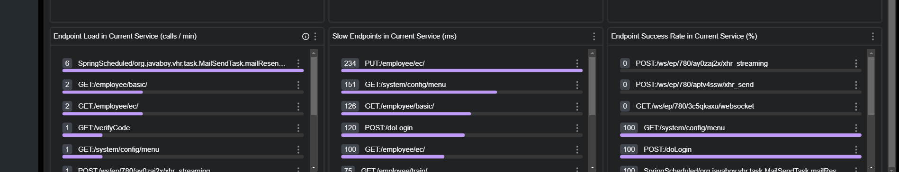


#### 链路图

在Topology中可以看到服务间的调用链路图

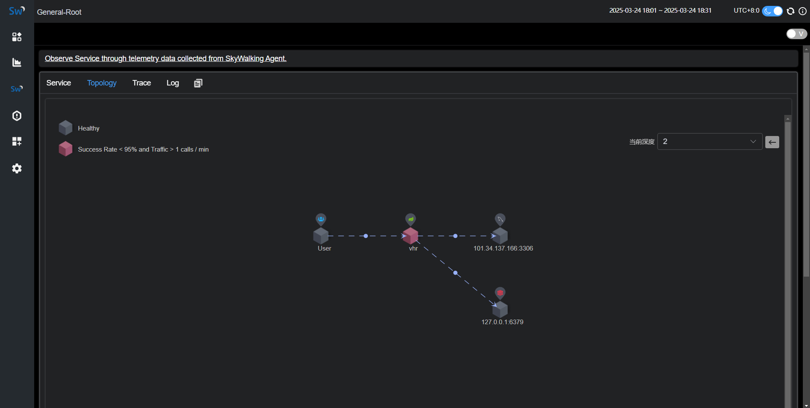

#### 模拟数据库

由于SkyWalking并未实际自身去连接Mysql，只是根据代码运行时连接数据源信息进行性能监控，因此这里叫模拟数据库

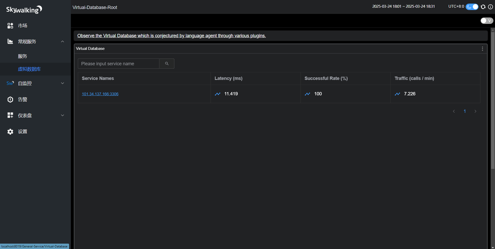

这里可以看到数据库的平均响应时间，数据库访问成功率，数据库每分钟请求数，数据库不同比例的响应时间

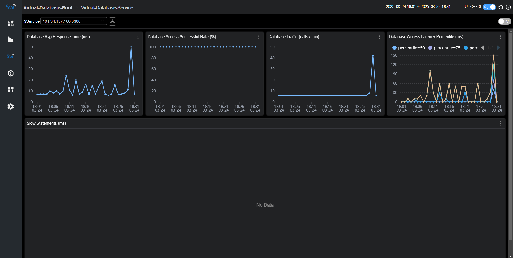

#### 

#### 请求链路追踪

在Trace模块中，可以看到请求的完整链路，准确定位一个请求在哪个阶段慢

可以复制TraceId进行精确搜索

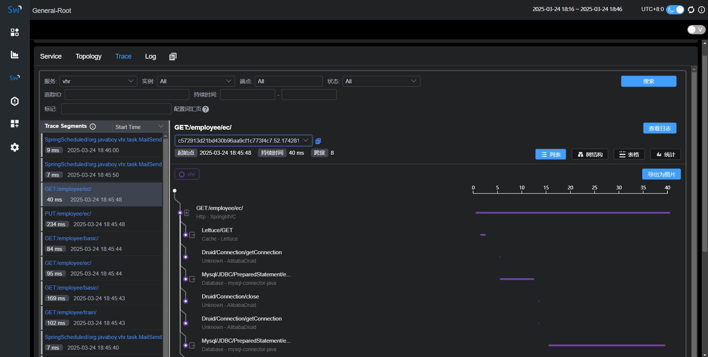

#### 实例详情信息

在Instance中点击id进入实例详情界面，这里可以看到JVM的相关性能

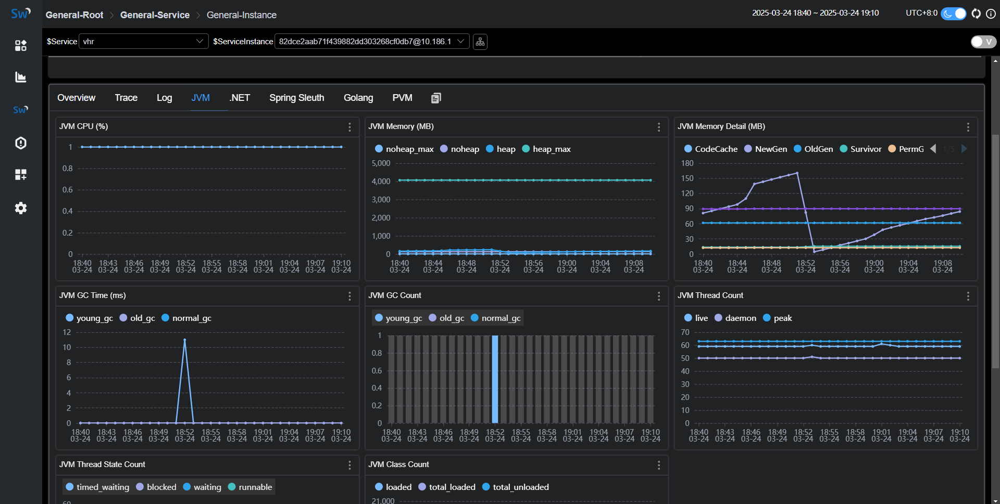

#### 监控任务

在Profile中可以自己新建一个监控任务，自定义需要监控的请求，进行数据采样

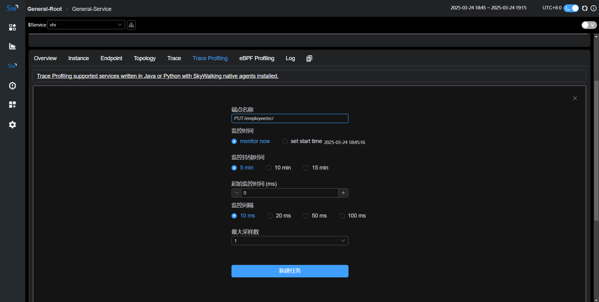


### 5 Skywalking自监控配置

将telemetry中的selector改为prometheus（普罗米修斯），重启服务即可

[prometheus（一）——监控组件简介-CSDN博客](https://blog.csdn.net/qq_44658961/article/details/109583349)

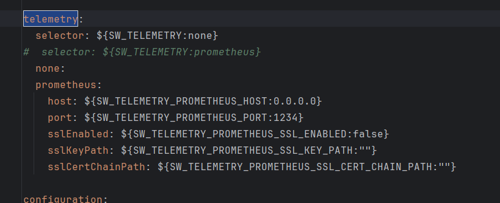

### 6 日志配置

Log模块需要进行特殊的配置才能正常显示

